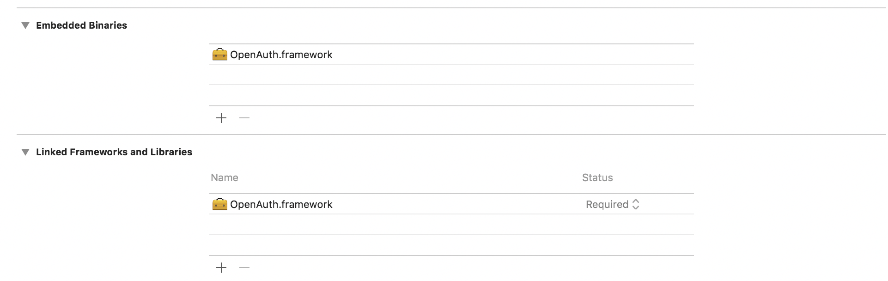

<p align="center" >
  
</p>


# OAuth2 for iOS

[](https://cocoadocs.org/docsets/OpenAuth)
[](https://cocoadocs.org/docsets/OpenAuth)
[](https://twitter.com/MedHajlaoui)

OpenAuth is a light framework for iOS written in swift 4. It provides an easy way to integrate OAuth2.0 in your iOS apps.


## Installation
### Installation with CocoaPods

We recommend using [CocoaPods](http://cocoapods.org) which automates and simplifies the process of using 3rd-party libraries like OpenAuth in your projects. 
You can install it with the following command:

```bash
$ gem install cocoapods
```

### Podfile

To integrate OpenAuth into your Xcode project using CocoaPods, specify it in your `Podfile`:

```ruby
pod 'OpenAuth'
```

Then, run the following command:

```bash
$ pod install
```

### Manual installation

Skip this section if you used CocoaPods to link OpenAuth to your project.

- Download the SDK located under OpenAuth/OpenAuth.framework
- Add `OpenAuth.framework` file to your project and add it to `Embedded Binaries`.
<p align="center" >
  
</p>

> Congratulations, the framework is fully integrated to the app and you can start using it.


## Enable the logger

Optionally, you can enable to the logger. Use the following code to set a logging level to the logger:


```swift
OpenAuth.logger.level = .verbose
```

                  
You can choose one of the following logging levels:

- verbose
- info
- warning
- error
- none

## Add your OAuth2 configuration

### OpenAuth.plist file

OpenAuth loads automatically your OAuth2 configuration from `OpenAuth.plist` plist file.
The following is a description of all configurations you can put in the file

| Key        			| Type          | Required   |Description  |
|:-----------------:|:-------------:|:----------:|:------------|
| **`CLIENT_ID`**     			| String | Yes | The client id |
| `CLIENT_SECRET`  				| String | No | The client secret, usually only needed for code grant. |
| `CLIENT_NAME`  				| String | No | The name of the client, used during dynamic client registration. |
| `LOGO_URI`  					| String | No | An URL of the logo/icon of the app. |
| **`AUTHORIZE_URI`**  			| String | Yes | The URL to authorize against. |
| **`TOKEN_URI`**  				| String | Yes | The URL to exchange a code for a token. |
| `REGISTRATION_URI`  			| String | No | The URL to register a client. Used during dynamic client registration. |
| **`REDIRECT_URIS`** 			| Array of String | Yes | The list of redirect URIs. |
| `SCOPE`  						| String | No | The scope currently in use. |
| `SECRET_IN_BODY`  			| Bool | No | Whether the receiver should use the request body instead of the Authorization header for the client secret; defaults to `false`. |
| `HEADERS`  						| Dictionary | No | Contains special authorization request headers, can be used to override defaults |
| `PARAMETERS`  					| Dictionary | No | Add custom parameters to the authorization request. |
| `TOKEN_ASSUME_UNEXPIRED`  	| Bool | No | If set to true (the default), uses a keychain-supplied access token even if no "expires_in" parameter was supplied. |
| `ENABLE_KEYCHAIN`  			| Bool | No | If set to false (the default), Keychain support will be disabled. |
| `TOKENS_KEYCHAIN_ACCOUNT`  	| String | No | The keychain account to use to store tokens. Defaults to `currentTokens`. 	|
| `CLIENT_KEYCHAIN_ACCOUNT`  	| String | No | The keychain account name to use to store client credentials. Defaults to `clientCredentials`. |
| `KEYCHAIN_ACCESS_MODE`  		| String | No | Defines the keychain access mode. Defaults to `kSecAttrAccessibleWhenUnlocked` |
| `KEYCHAIN_ACCESS_GROUP` 		| String | No | Defines the keychain access group identifier allowing token exchange between different apps of the same group. None is defined as default. |


##### Note

For `KEYCHAIN_ACCESS_MODE`, possible values are:
 
 * **kSecAttrAccessibleWhenUnlocked**: Item data can only be accessed while the device is unlocked. This is recommended for items that only need be accesible while the application is in the foreground. Items with this attribute will migrate to a new device when using encrypted backups.
 * **kSecAttrAccessibleAfterFirstUnlock**: Item data can only be accessed once the device has been unlocked after a restart.  This is recommended for items that need to be accesible by background applications. Items with this attribute will migrate to a new device when using encrypted backups.
 * **kSecAttrAccessibleAlways**: Item data can always be accessed regardless of the lock state of the device. This is not recommended for anything except system use. Items with this attribute will migrate to a new device when using encrypted backups.
 * **kSecAttrAccessibleWhenPasscodeSetThisDeviceOnly**: Item data can only be accessed while the device is unlocked. This is recommended for items that only need to be accessible while the application is in the foreground and requires a passcode to be set on the device. Items with this attribute will never migrate to a new device, so after a backup is restored to a new device, these items will be missing. This attribute will not be available on devices without a passcode. Disabling the device passcode will cause all previously protected items to be deleted.
 * **kSecAttrAccessibleWhenUnlockedThisDeviceOnly**: Item data can only be accessed while the device is unlocked. This is recommended for items that only need be accesible while the application is in the foreground. Items with this attribute will never migrate to a new device, so after a backup is restored to a new device, these items will be missing.
 * **kSecAttrAccessibleAfterFirstUnlockThisDeviceOnly**: Item data can only be accessed once the device has been unlocked after a restart. This is recommended for items that need to be accessible by background applications. Items with this attribute will never migrate to a new device, so after a backup is restored to a new device these items will be missing.
 * **kSecAttrAccessibleAlwaysThisDeviceOnly**: Item data can always be accessed regardless of the lock state of the device.  This option is not recommended for anything except system use. Items with this attribute will never migrate to a new device, so after a backup is restored to a new device, these items will be missing.

 
### Minimal Viable Configuration
You can download [here](assets/plists/min/OpenAuth.plist) a plist file with the minimum required configuration or copy the XML in your Project OpenAuth.plist resource

```xml
<?xml version="1.0" encoding="UTF-8"?>
<!DOCTYPE plist PUBLIC "-//Apple//DTD PLIST 1.0//EN" "http://www.apple.com/DTDs/PropertyList-1.0.dtd">
<plist version="1.0">
<dict>
	<key>CLIENT_ID</key>
	<string></string>
	<key>AUTHORIZE_URI</key>
	<string></string>
	<key>TOKEN_URI</key>
	<string></string>
	<key>REDIRECT_URIS</key>
	<array>
		<string></string>
	</array>
</dict>
</plist>

```

### Full Configuration
You can download [here](assets/plists/full/OpenAuth.plist) a plist file with all available keys for an advanced configuration or copy the XML in your Project OpenAuth.plist resource

```xml
<?xml version="1.0" encoding="UTF-8"?>
<!DOCTYPE plist PUBLIC "-//Apple//DTD PLIST 1.0//EN" "http://www.apple.com/DTDs/PropertyList-1.0.dtd">
<plist version="1.0">
<dict>
	<key>CLIENT_ID</key>
	<string></string>
	<key>AUTHORIZE_URI</key>
	<string></string>
	<key>TOKEN_URI</key>
	<string></string>
	<key>REDIRECT_URIS</key>
	<array>
		<string></string>
	</array>
	<key>CLIENT_SECRET</key>
	<string></string>
	<key>CLIENT_NAME</key>
	<string></string>
	<key>LOGO_URI</key>
	<string></string>
	<key>REGISTRATION_URI</key>
	<string></string>
	<key>SCOPE</key>
	<string></string>
	<key>SECRET_IN_BODY</key>
	<false/>
	<key>HEADERS</key>
	<dict/>
	<key>PARAMETERS</key>
	<dict/>
	<key>TOKEN_ASSUME_UNEXPIRED</key>
	<true/>
	<key>ENABLE_KEYCHAIN</key>
	<false/>
	<key>TOKENS_KEYCHAIN_ACCOUNT</key>
	<string></string>
	<key>CLIENT_KEYCHAIN_ACCOUNT</key>
	<string></string>
	<key>KEYCHAIN_ACCESS_MODE</key>
	<string>kSecAttrAccessibleWhenUnlocked</string>
	<key>KEYCHAIN_ACCESS_GROUP</key>
	<string></string>
</dict>
</plist>
```

## Handle Redirect URL

On your AppDelegate.swift file, import OpenAuth and implement the following method

```swift
	func application(_ app: UIApplication, open url: URL, options: [UIApplicationOpenURLOptionsKey : Any] = [:]) -> Bool {
        OpenAuth.shared.handleRedirect(url: url)
        return true
    }
```

## Acquire the token

To acquire the access token, import OpenAuth in your code and call the following function

```swift
	OpenAuth.acquireToken(success: { (token: String) in
            //Use your token here
        }) { (error: Error) in
            //Handle error here
        }
```

To force OpenAuth to display a safari view controller embedded in your app, set the embedded Boolean attribute to true and provide a context from which OpenAuth will display the safari controller. The context can be the current view controller, a navigation view controller or any other view controller based objects

```swift
	OpenAuth.acquireToken(authorizeContext: context, embedded: true, success: { (token: String) in
           //Use your token here
        }) { (error: Error) in
           //Handle error here
        }
```

## Logout

To logout, use the logout function as indicated in the following snippet code. OpenAuth will forget all tokens and remove any stored cookies related to its flows.

```swift
	OpenAuth.logout()
```

## Credit

All credits go to [Pascal Pfiffner](https://github.com/p2).
Most of the SDK is inspired by [p2.OAuth2](https://github.com/p2/OAuth2) swift librairy.


## License

OpenAuth is released under an Apache 2.0 license. See [LICENSE](https://github.com/medhaj/OpenAuth/blob/master/LICENSE) for more details.
